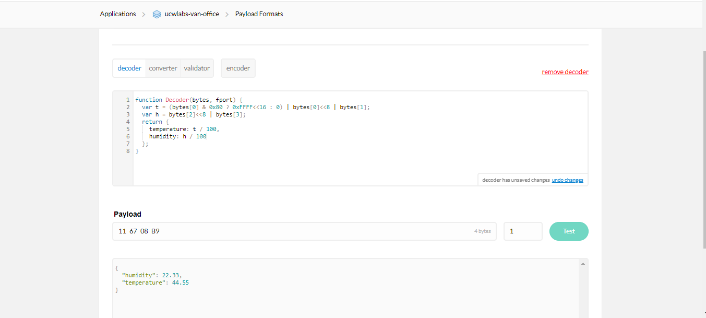

 
## INSTALLATION

Clone (or download and unzip) the repository to ~/Documents/Arduino/getting-started-with-lora 
		
* cd ~/Documents/Arduino
* git clone https://gitlab.unitycloudware.com/ucw-labs/getting-started-with-lora

			
## LIBRARIES

Ensure the following libraries, in addition to [UCW arduino library](https://gitlab.unitycloudware.com/ucw-labs/ucw-arduino-library/tree/develop), have been installed:

1 arduino libraries:  	
* Adafruit_SGP30
* Adafruit_Sensor
* Adafruit_TSL2591
* Adafruit_BME280
	
by taking the following steps:  
* Go to: Sketch -> Include Library -> Manage Libraries...
* enter the libraries in #1 above in the search bar and install

2 Contributed libraries:
* [DHT](https://github.com/adafruit/DHT-sensor-library)
* [lmic](https://github.com/matthijskooijman/arduino-lmic)
* [RH_RF95](https://github.com/PaulStoffregen/RadioHead)
					
by taking the steps below:
* download the libraires using the links provided
* rename the uncompressed folder downloaded by removing "-master" from the name
* place this renamed folder in your \Arduino\libraries folder
  
## LORA DEMO WITH DHT 22 SENSOR
The following steps deal more on the DHT22 example

## INCLUDE THE NECESSARY LIBRARIES
Include the following files below. If you are using UCW library, only include DHT library
```
#include <lmic.h>
#include <hal/hal.h>
#include <SPI.h>
#include <DHT.h>
```

## DECLARE DHT PIN AND TYPE AND CREATE OBJECT
  
Provide the I/O pin that is connected to the DHT PIN 2 (data pin) and DHT type
```
#define DHTPIN 6
#define DHTTYPE DHT22
```
Create DHT object
```
DHT dht(DHTPIN, DHTTYPE);
```

## FOR ABP, PROVIDE NWKSKEY, APPSKEY, DEVADDR
  
```
// LoRaWAN NwkSKey - Network session key
static const PROGMEM u1_t NWKSKEY[16] = { 0x43, 0xB5, 0x99, 0x20, 0xA5, 0xDA, 0x6B, 0x73, 0x79, 0xFD, 0x53, 0xED, 0x45, 0xE6, 0x36, 0xBE };

// LoRaWAN AppSKey - Application session key
static const u1_t PROGMEM APPSKEY[16] = { 0xE1, 0x05, 0x7C, 0x8C, 0xFC, 0xF6, 0xE1, 0x36, 0xF9, 0x03, 0x27, 0xB7, 0x6D, 0x8B, 0x85, 0xFD };

// LoRaWAN end-device address (DevAddr)
static const u4_t DEVADDR = 0x26011885; // <-- Change this address for every node!

```
For code using UCW library, the above variables are initialised in config.h 

## LoRaWAN CONFIGURATION USING UCW LIBRARY
Depending on the desired activation mode (ABP or OTTA), call the appropriate method to initialise the module
```
//for ABP
lora_wan.initABP(NWKSKEY, APPSKEY, DEVADDR);

//for OTAA
lora_wan.initOTAA(APPEUI, APPKEY, DEVEUI);
``` 

## READING THE DATA
  
Read and collect data from the sensor or any device as defined by the user

```
// Read humidity
int16_t h = dht.readHumidity() * 100;
// Read temperature as Celsius (the default)
int16_t t = dht.readTemperature() * 100;

byte myData[4];
myData[0] = highByte(t);
myData[1] = lowByte(t);
myData[2] = highByte(h);
myData[3] = lowByte(h);
```
    	
  
## SINGLE OR MULTI-CHANNEL GATEWAY
  
The gateway, by default, operates using multi-channel communication mode. If the user wants to test single-channel communication, use the line below. You can find the installion guide for single-channel gateway [here](https://www.hackster.io/ChrisSamuelson/lora-raspberry-pi-single-channel-gateway-cheap-d57d36)   
```
//for Europe
for (int i = 1; i <= 8; i++) LMIC_disableChannel(i);

//for North America
for (int i = 1; i <= 71; i++) LMIC_disableChannel(i);
```

Using UCW arduino library, the method below is called to achieve this. This applies to ABP only
```
//for multi-channel. Set to FALSE for single channel
lora_wan.channelConfig(true);
``` 

## PAYLOAD  FORMAT

Use the decoder functions below as payload function at the [TTN console](https://console.thethingsnetwork.org) for DHT 22,
bme280, airQuality and lux examples respectively
```
function Decoder(bytes, fport) {
  var t = (bytes[0] & 0x80 ? 0xFFFF<<16 : 0) | bytes[0]<<8 | bytes[1];
  var h = bytes[2]<<8 | bytes[3];
  return {
    temperature: t / 100,
    humidity: h / 100
  };
}
```
bme280_example
```
function Decoder(bytes, fport) {
  var t = (bytes[0] & 0x80 ? 0xFFFF<<16 : 0) | bytes[0]<<8 | bytes[1];
  var h = bytes[2]<<8 | bytes[3];
  var p = bytes[4]<<8 | bytes[5];
  return {
    temperature: t / 100,
    humidity: h / 100,
    pressure: p / 100
  };
}
```
airQuality_example
```
function Decoder(bytes, fport) {
  var TVOC = (bytes[0] & 0x80 ? 0xFFFF<<16 : 0) | bytes[0]<<8 | bytes[1];
  var eCO2 = bytes[2]<<8 | bytes[3];
  return {
    TVOC: TVOC,
    eCO2: eCO2
  };
}
```
lux_example
```
function Decoder(bytes, fport) {
  var lux = (bytes[0] & 0x80 ? 0xFFFF<<16 : 0) | bytes[0]<<8 | bytes[1];
  return {
    lux: lux
  };
}
```
The resultant payload in JSON format for the DHT22 example can be seen below:


   
## FULL EXAMPLE
  
The full code for DHT22 example can be found [here](https://gitlab.unitycloudware.com/ucw-labs/workshop/getting-started-with-lora)
